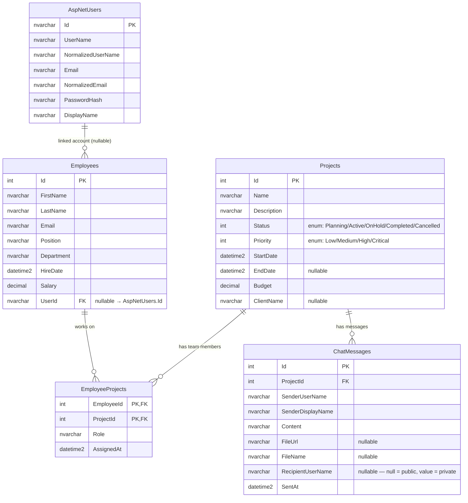

# Database Schema — Project Manager (Variant 4)

## Entity-Relationship Diagram



## Tables Summary

| Table | Description |
|---|---|
| `AspNetUsers` | ASP.NET Core Identity users (extended with `DisplayName`) |
| `Employees` | Company employees; optional link to a user account via `UserId` |
| `Projects` | Projects with status, priority, budget, dates |
| `EmployeeProjects` | Many-to-many join: which employees work on which projects and in what role |
| `ChatMessages` | Per-project chat; `RecipientUserName = null` → public broadcast, otherwise private DM |

## Relationships

```
AspNetUsers ──── Employees          (1 : 0..1)  optional account link, ON DELETE SET NULL
Employees ──── EmployeeProjects     (1 : N)     employee can work on many projects
Projects ──── EmployeeProjects      (1 : N)     project can have many employees
Projects ──── ChatMessages          (1 : N)     project can have many chat messages
```

## Composite Primary Key

`EmployeeProjects` uses a composite PK `(EmployeeId, ProjectId)` — defined in `AppDbContext.OnModelCreating`:
```csharp
builder.Entity<EmployeeProject>()
    .HasKey(ep => new { ep.EmployeeId, ep.ProjectId });
```

## Identity tables (managed by ASP.NET Core Identity)

The following tables are created automatically by `IdentityDbContext`:

| Table | Purpose |
|---|---|
| `AspNetUsers` | User accounts |
| `AspNetRoles` | Roles (`Admin`, `User`, …) |
| `AspNetUserRoles` | User ↔ Role mapping |
| `AspNetUserClaims` | Per-user claims |
| `AspNetRoleClaims` | Per-role claims |
| `AspNetUserLogins` | External login providers |
| `AspNetUserTokens` | Refresh / access tokens |
